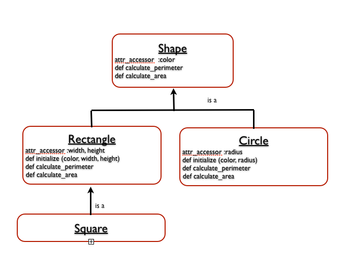
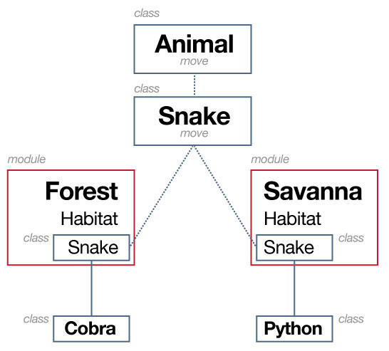

#BEWD - Sharing Behavior

---

##Agenda

* Reviewing Scope
* Sharing Code: Inheritance
* Sharing Code: Mixins
* Lab Time

---

##Scope
###Method Scope

``` ruby

	def SuperHero
		def fly
      "Here we go!"
    end
	end

  def fly
    "I can't."
  end

	>> superman = SuperHero.new
  >> superman.fly
  => "Here we go!"
  >> fly
  => "I can't."

```
---

##Scope
###Class Methods

* You don't need an instance to call a class method
* Below is an example of the SecretNumber class re-implemented to use a class method
* BONUS: Go back and re-implement secret number exercise using a class method (HINT: the Game object stores the number, so you dont need a secret number object to do so)

  ``` ruby
  class SecretNumber
    # gets a random number between 0-9, adds one so it's between 1-10
    def self.generate
      rand(10)+1
    end
  end

  >> number = SecretNumber.generate
  ```
---

##Class Methods
###Knowing Self

*	self keyword is used when defining a method name to indicate a class method
* self is also used INSIDE a method definition to indicate the current object
* a common use of self is to call the current objects methods (such as one of its attr_accessors)
* below, self is used to indicate that 'generate_random_story' is a class method
* in addition, self is then used to call the "stories" attr_accessor method on the NewsPaper instance (an attr_accessor getter method returns the instance variable e.g. @stories)

``` ruby
		class NewsPaper
      attr_accessor :stories

			def self.generate_random_story
				"This random event happened on day #{rand(28)} of this month."
			end

			def add_story(story)
        # the below code is the same as: @stories << story
				self.stories << story
			end
		end

    >> story = NewsPaper.generate_random_story
    => "This random event happened on day 20 of this month."
    >> paper = NewsPaper.new
    >> paper.add_story(story)
    >> paper.stories
    => ["This random event happened on day 20 of this month."]
```
---


##Sharing Behavior
###Sharing is Caring

*	Inheritance
*	Mixins
*	Modules

---

##Inheritance
###"I got is from my momma" - Will.i.am

*	Share properties & behavior
*	Keeps code DRY

---


##Inheritance


---


##Inheritance

---


##Inheritance
###Glimpse into Rails

*	Where you'll see it…
```
		class User < ActiveRecord::Base
		end
```


---

##Inheritance
###Recap

*	One class can inherit the capabilities of another using the ```<``` operator.
*	Sub-class inherits from super-class (child class inherits from parent class)
*	A child can override a parent variable or method by re-using its name
class.

*	If defined in different physical files, a child must require its parent
* (this won't be the case in rails but is required with pure ruby)

---


##Sharing Behavior
###Getting Ready For Rails

*	The following slides introduce other ways to share behavior.
*	This is an introduction and we will see more when we start Rails.
*	For now lets understand the basics.


---


##Sharing Behavior
###Mixins

* "Mixins" are a facility to import code into a class
* They are used in cases when we don't want to use inheritance
  * Perhaps we only want a few methods from a small module, not the whole class
  * A class may want to mixin many different modules, but you can only inherit from one class
* In Ruby, we use Modules to facilitate mixins

---

##Mixins
###Teddit as an example

*	Lets say teddit now accepts photos, videos and stories.


*	You can up and down vote all of them.


---

##Mixins
###Upvotable Example
``` ruby
	module Upvotable
		def upvote!
  		@upvote += 1
  	end

  	def downvote!
  		@upvote -= 1
  	end
	end

	class Photo
		attr_reader :photographer, :resolution, :upvotes
		include Upvotable

		def initialize(photographer, resolution)
  		@photographer = photographer
  		@resolution = resolution
  		@upvotes = 1
  	end
	end

	class Story
		attr_reader :title, :author, :upvotes
		include Upvotable

		def initialize(title, author)
  		@title = title
  		@author = author
  		@upvotes = 1
  	end
  end

  >> story = Story.new
  >> story.upvote!
  >> photo = Photo.new
  >> photo.downvote!
```
---

##Sharing Behavior
###Modules

*	What if we wanted to have two bat classes.
``` ruby
		class Bat
			def fly!
				puts "So free.. and blind"
			end
		end

		# Somewhere else in your code
		class Bat
			def made_of
				"wood"
    	end
		end

		slugger = Bat.new
		slugger.fly?!??!
```
---

##Inheritance vs Mixins
###What's the difference?

* inheritance (class SomeClass < OtherClass) is used to _inherit_ the methods from one class into another class
* include (include SomeModule) is used to _import_ the methods from one module into a class

---

##Inheritance vs Mixins
###When to use which?

* really up to you
* adjective (mixin) vs noun (inheritance)
* http://stackoverflow.com/questions/1282864/ruby-inheritance-vs-mixins

---


##Ruby
###Success!

*	Congrats! You're ready to start working with Rails!

---


##Lab Time

*	Midterm
*	Secret Number (if you haven't finished)

---


## Homework

*	Midterm due lesson 8.

---

##RESOURCES: More on Modules
###Namespacing

* We can define methods/classes with the same name, but namespaced differently
* We would do this if (in example below) we wanted the Bat to behave differently depending on which namespace it belongs to
* You will rarely use module namespacing (not at all in this course)
```
  module Animal
    class Bat
      def fly!
        puts "So free.. and blind"
      end
    end
  end

  Animal::Bat.new

  module BaseballUtensils
    class Bat
      def made_of
        "wood"
      end
    end
  end

  BaseballUtensils::Bat.new
```
---


##RESOURCES: More on Modules
###Namespacing




---

<div id="resources">
## Resources: Sharing Behavior

Good code should be reused!

###Cheat Sheet

####load vs. require vs. include

Why do they all sound the same??!!!!

*	load: inserts a file's contents
	*	File can be loaded more than once.

		```load 'config.rb'```

*	require inserts parsed contents: We use it to require a class in another .rb file.
	*	File is only required once.

		```require 'config'```

*	include 'mixes in' modules. Use to include modules and mixins.

		```include 'my_module'```

####Inheritance
*	One class can inherit the capabilities of another using ```<```
*	Sub-class inherits from super-class
(child class inherits from parent class)

*	If defined in different physical files, a child must require its parent

-- lib/person.rb ---

```ruby
	class Person
	end

```

--- lib/worker.rb ---

```ruby

	require 'lib/person'

	class Worker < Person
	end
```

Heres a lengthy example:

*	Don't repeat yourself (DRY)
*	Don't do this!

```ruby
	class ScienceSubteddit
  		@@name = "Science"
  		@@description = "Where we blow stuff up for fun"
  		def self.welcome
    		puts "Welcome to the #{@@name} Subteddit!"
    		puts @@description
  		end
	end

	class MoviesSubteddit
  		@@name = "Movies"
  		@@description = "Because the Matrix was awesome"
  		def self.welcome
    		puts "Welcome to the #{@@name} Subteddit!"
    		puts @@description
  		end
	end

	class SportsSubteddit
  		@@name = "Sports"
  		@@description = "We have big muscles and we run fast"
  		def self.welcome
    		puts "Welcome to the #{@@name} Subteddit!"
    		puts @@description
  		end
	end

	class RubySubteddit
  		@@name = "Ruby"
  		@@description = "Because Python Sucks"
  		def self.welcome
    		puts "Welcome to the #{@@name} Subteddit!"
    		puts @@description
  		end
	end
```


*	This is a better approach and demonstrates the benefit of using Object Oriented programming.
	*	News sections inherit from Subteddit.


```ruby
	class Subteddit
  		@@name = ""
  		@@description = ""
  		def self.welcome
    		puts "Welcome to the #{@@name} Subteddit!"
    		puts @@description
  		end
	end

	class ScienceSubteddit < Subteddit
  		@@name = "Science"
  		@@description = "Where we blow stuff up for fun"
	end

	class MoviesSubteddit < Subteddit
  		@@name = "Movies"
  		@@description = "Because the Matrix was awesome"
	end

	class SportsSubteddit < Subteddit
  		@@name = "Sports"
  		@@description = "We have big muscles and we run fast"
	end

	class RubySubteddit < Subteddit
  		@@name = "Ruby"
  		@@description = "Because Python Sucks"
	end
```

####Mixins

*	Include a module in a class to access the module's methods. This also keeps code DRY.

```ruby
	module MyModule
  		def module_method(parameters)
    		return parameter
  		end
	end
```

```ruby
	class MyClass
		include MyModule
	end


	my_object = MyClass.new
	my_object.module_method
```

####Modules

Ruby exposes much core functionality through modules

A commonly used built in module is Math
The :: operator is used to refer to a constant set in a module

```ruby
	puts Math.sqrt(9)
```

>3.0


```ruby
	puts Math::PI
```
>3.1415926


*	A module is like a class, except
	*	You cannot create a new instance of a module
	*	You cannot extend a module to create a child module


*	Modules are a way to add namespaces

Ruby docs have a full list of available modules.


__Method Scope__

```ruby
	class GA_course
		def initialize (course_name)
			@course_name = course_name
		end

		def announce_course
			puts "GA has a course on #{@course_name}"
		end

		def self.announce_courses
			puts "GA has a course on BEWD"
			puts "GA has a course on FEWD"
			puts "GA has a course on CSF"
			puts "GA has a course on DAT"
			puts "GA has a course on UXD"
			puts "GA has a course on PDM"
		end
	end

	my_course = GA_course.new("BEWD")
	my_course.announce_course #
	GA_Course.announce_courses
```

>GA has a course on BEWD

>GA has a course on BEWD
>GA has a course on FEWD
>GA has a course on CSF
>GA has a course on DAT
>GA has a course on UXD
>GA has a course on PDM


###Still Feel Lost?

Its ok, we will see these terms again in Rails, but you can also,

####Catch Up With These Resources

*	Working with Enumerables [Video](http://vimeo.com/gatv/review/67752032/67e8f877bb)
	*	password => BEWD_GA
*	[Modules](http://marakana.com/bookshelf/ruby_tutorial/modules.html
)
*	[Mixins](http://samwho.co.uk/blog/2011/09/12/ruby-mixins/)


